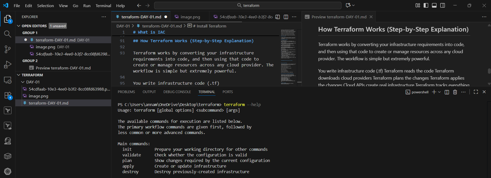

# What is IAC 

Infrastructure as Code (IaC) is the practice of defining, provisioning, and managing infrastructure using machine-readable configuration files rather than manual processes. in general words, Infrastructure as Code means you create and manage servers, networks, databases, and cloud resources using code instead of doing everything manually.

Instead of logging into servers and configuring them manually, you write code (YAML, JSON, HCL, etc.) that describes:

1) Compute resources

Networks

Storage

Security policies

Application environments

This code is then executed by IaC tools to automatically create and manage infrastructure.

## Why IaC Matters

Consistency: Eliminates manual errors; environments remain identical across dev, test, and production.

Version control: Infrastructure definitions are stored in Git; you can track changes, rollback, and collaborate.

Automation: Fast provisioning and de-provisioning.

Scalability: Easily replicate and scale environments.

Cost control: Automate cleanup and resource governance

## Why we need IAC

In modern DevOps and cloud environments, Infrastructure as Code (IaC) has become more than a best practice — it is a necessity.

## Here’s why IaC matters:

1. Zero Manual Errors
Manual provisioning leads to inconsistencies. IaC delivers predictable, error-free environments every time.

2. Speed & Automation
Entire environments can be deployed in minutes using code — no manual console clicks or long setup cycles.

3. Repeatability Across Environments
Dev, QA, and Prod must behave the same. IaC ensures identical configurations everywhere.

4. Version-Controlled Infrastructure
With IaC, infrastructure changes live in Git. You can track, review, and roll back changes just like application code.

5. Easy Scalability
Need to scale from 3 servers to 30? Update the code and apply — IaC handles the rest.

6. Cost Optimization
IaC enables automated cleanup, scheduled shutdowns, and environment replication only when needed.

7. Better Team Collaboration
Everyone works from the same codebase, improving transparency and reducing dependency on manual knowledge.

8. Faster Disaster Recovery
If something fails, the entire setup can be recreated instantly with a single command.

IaC isn’t just a tool — it’s the backbone of modern cloud automation, stability, and speed.

## Chanllenges that faces with out Terraform

## How Terraform Helps:

Terraform helps by solving the major challenges that come with manually provisioning cloud infrastructure. The several key benefits are:

Automates Infrastructure Provisioning

Eliminates Manual Repetition

Ensures Consistency Between Environments

Reduces Human Errors

Saves Cost and Resources

Increases Team Productivity

Enables Reusability (Write Once → Deploy Many)

## How Terraform Works (Step-by-Step Explanation)

Terraform works by converting your infrastructure requirements into code, and then using that code to create or manage resources across any cloud provider. The workflow is simple but extremely powerful.

You write infrastructure code (.tf)
Terraform reads the code
Terraform downloads cloud providers
Terraform plans the changes
Terraform applies the changes
Cloud APIs create real infrastructure
Terraform tracks everything in a state file
You can update or destroy infrastructure anytime using code

# Install Terraform
Follow the installation guide: https://developer.hashicorp.com/terraform/install

blog : https://saiprasad-terraform-iac.hashnode.dev/infrastructure-as-code-iac-inspired-by-how-terraform-works-day-1-of-my-30daysofawsterraform-challenge?showSharer=true
